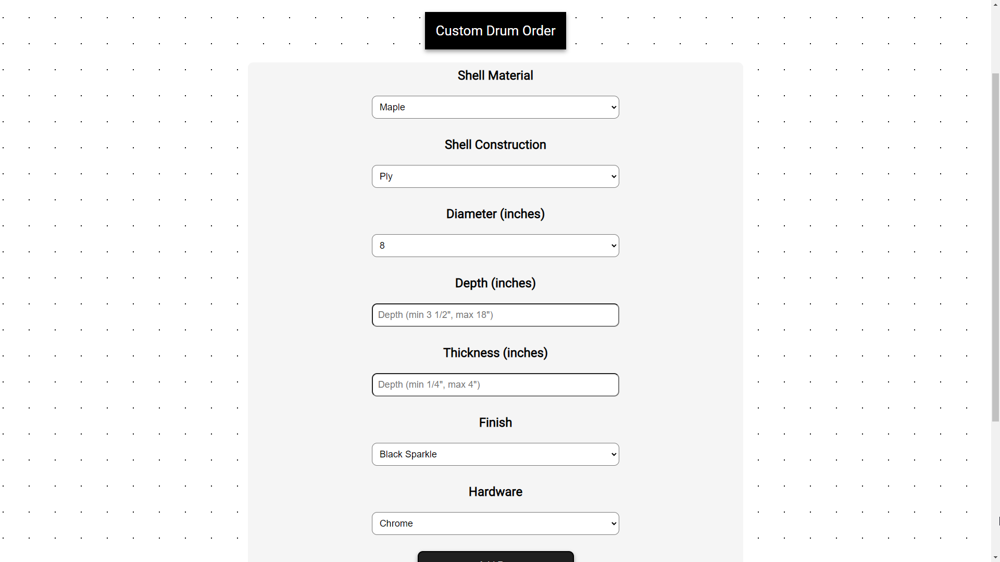
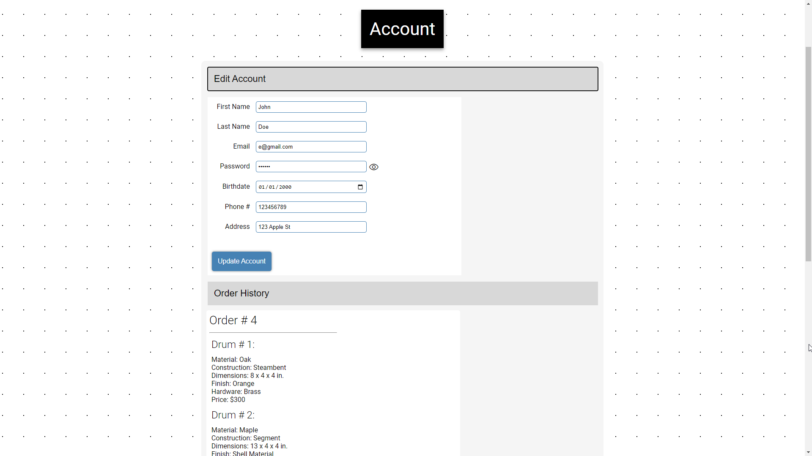

# Mohonk Ridge Drums
---
A mock website allowing customers to place orders for custom-built drums.


---

## What is Mohonk Ridge Drums?
Mohonk ridge drums is a fully-functional, MVC-based website that allows users to place orders for drum shells built to their specifications. Users can do so by creating an account, customizing their drum shells, adding them to the cart, and then placing an order. Users can also view their order history, change account information, logout, and delete their account on the **Account** page. 



Designed with minimalism in mind, users can simply specify the wood species, construction, dimensions, finish, and hardware of their drum shells in the **Shop**. Items can be **added** to and **removed** from the cart, which also checks that there is at least one item before placing an order. Users must be logged in to use the shop.

Since Mohonk Ridge Drums uses a database to store records, the user can simply leave off from where they were if they decide to logout and add items to the cart later. The cart of items re-renders every time the shop page is accessed, or an item is added to or removed from the cart. Similar to how a library like *React* works, re-rendering the cart ensures that the front-end and database are tied together. 



Once an order is placed, the cart is cleared, and the user can **view** their order history on the **Account** page. Each order is rendered separately by creating a list of *orders*, in which each ID is matched with an *order item* so that every drum can be displayed. Other information, like order # (which is unique across *all* accounts), date, shipping address, and grand total are also shown. If a user has no orders, a message will be displayed instead.

Users can also **update** their information by opening the account page accordion, which will be updated in the database. Updating account information does not create issues in displaying orders or adding to a cart because a unique *user id* serves as an identifier for each account.

Lastly on the account page, users can simply logout, or delete their account entirely.

---

## Entity-Relationship Diagram


The Mohonk Ridge Drums website consists of four entities - *USER*, *ORDER*, *ORDER ITEMS*, and *CART*. The back-end of the website uses the MVC model in order to consistently send, store, and return data to and from the front-end. 

The USER entity is linked with the ORDER and CART entities since the *user ID* identities who the order and cart belongs to. The ORDER entity acts as a "container" which is linked with ORDER ITEMS entities. Since an ORDER can contain many items, the application must be able to match each *order ID* in the ORDER entity with the ID in the ORDER ITEMS entity. 

The CART and ORDER ITEMS entities are mostly similar, except that only the CART entity is mutable. Items can be added to and removed from the cart, and gets copied over to ORDER ITEMS when an order is placed. The CART entity is not a container, and instead is an individual record for each drum the user may order or remove from the cart. When an order is placed, the entities are destroyed by removing all records that match the user's ID in the database.

---

## Technologies Used
### Front-End
* HTML5
* CSS3
* JavaScript
### Back-End
* Node.js
* Express.js
* MySQL2
* dotenv
* date-fns
* nodemon (devDependency)

---

## Setup & Dependencies

### Installation

User must be using a browser that supports JavaScript.

Navigate to the working directory, open the terminal and type the following:

```
npm install
```

After installing the dependencies (listed above in the back-end technologies), a ``.env`` file must be created in the root folder of the directory. In the file, enter a password in the MYSQL_PSWD field:

```
MYSQL_USERNAME = "root"
MYSQL_PSWD = ""
MYSQL_HOST = "localhost"
MYSQL_DB = "mhr_db"
```

Once the .env file has been set up, the application can be run by entering the following in the terminal:

```
node index.js
```

### Demo
An example user and order has been provided in their respective model files. The account can be logged in, and the order history can be viewed on the **Account** page. Log in with email ``e@gmail.com`` and password ``banana`` to use the example account. From there, items can be added and removed from the cart, orders can be placed, and account info can be changed. If the account is deleted, it will be re-initiated when the application is restarted.

---

## Future Improvements & Issues

I'm planning on rewriting the entire website using React, which would hopefully cut down the amount of code since the headers, footers and other buttons can be reused. As far as styling, I'd like to use either Bootstrap or Tailwind. 

As of now, a random price is generated for each item whenever a user adds an item to a cart. Due to time constraints I could not think of an individual price for every option. However, I will eventually make a database that will contain every option, and calculate prices based on drum shell dimensions.

One issue I was running into was when the cart would be rendered whenever a user adds an item to a cart. The databases were not updating quickly enough by the time the ``renderCart()`` function was being called, so it kept returning the same amount of items from before. I created a delay when adding and removing items from the cart to prevent this from happening.
